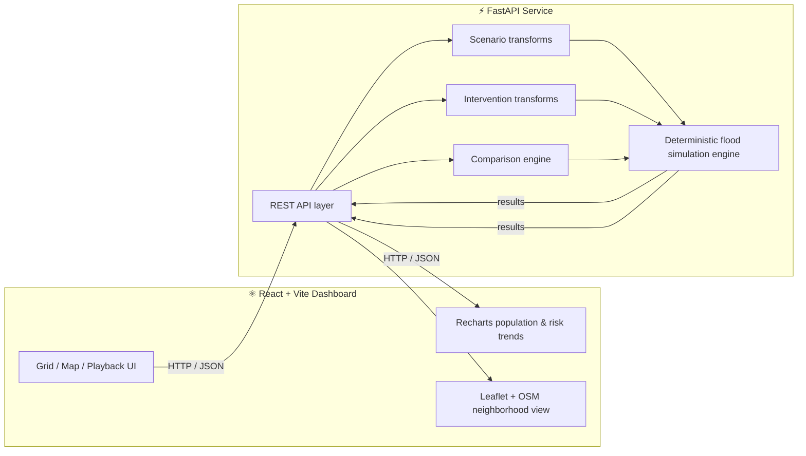

<div align="center">

# 🌊 FLOWSHIELD

### Predict the flood. Test the response. Save the region.

An explainable **flood-simulation & decision-support engine** — built in 24 hours for **Hack-a-Matics 2026** (VECTOR theme)


[](backend)
[](backend)
[](frontend)
[](frontend)
[](frontend)
[](frontend)

[](backend/tests)
[](#-license)
[](#-important-disclaimer)
[](#)

<br>

**[🚀 Quick Start](#-quick-start) · [🧠 How It Works](#-the-mathematical-model) · [📡 API](#-api-reference) · [🗺️ Demo Mode](#-demo-mode) · [⚠️ Limitations](#-core-assumptions--limitations)**

</div>

<br>

> [!IMPORTANT]
> FLOWSHIELD is a **simplified hackathon prototype**. It is **not** a calibrated operational flood-forecasting system, a real-time emergency service, or a public-safety instruction tool. Every number the app shows is a **modeled**, comparative output — clearly labeled as such throughout the UI. See [Core Assumptions & Limitations](#-core-assumptions--limitations).

<br>

## 📸 See It In Action

The application provides:

- Live flood progression and risk monitoring
- Bengaluru map and simulated neighborhood drill-down
- Scenario and intervention comparison
- Guided Demo Mode

Screenshots/demo GIFs can be added later when actual files are available.

<br>

## 💡 Why FLOWSHIELD

Bengaluru's **September 5, 2022** flood event affected areas including Mahadevapura, Bellandur, Varthur, K R Puram and Sarjapur after **131.6 mm of rain was recorded over 24 hours**.

FLOWSHIELD focuses on a practical decision-support question: how can a simplified simulation help users **test modeled intervention scenarios before committing resources**?

FLOWSHIELD asks a narrower, answerable question:

> *If it rains this much, and we take this drainage action — **how does the modeled outcome change**, region by region, before a single pump is deployed?*

The single continuous workflow:

```
   ☔ SIMULATE  →  📡 MONITOR  →  🚨 WARN  →  🧪 TEST RESPONSE  →  📊 COMPARE MODELED IMPACT
```

<br>

## ✨ Core Capabilities

<table>
<tr>
<td width="50%" valign="top">

**🌊 Flood Engine**
- Deterministic 2D water-balance simulation over a connected region grid
- Rainfall, elevation, drainage capacity, initial water, population & connectivity as inputs
- Safe / Warning / Critical risk classification
- Early-warning forecast with first-warning / first-critical timing and time-to-critical
- Timestep progression with play / pause / restart, slider, speed control, jump-to-warning/critical

**🧪 Scenario Lab**
- Normal, heavy & extreme rainfall presets
- Drainage failure simulation
- Blocked drainage channel simulation

</td>
<td width="50%" valign="top">

**🛠️ Intervention Lab**
- Unblock drain · Increase drainage capacity
- Emergency pumping · Restore blocked channel
- Preview modeled drainage/input changes before running the comparison

**📊 Impact Comparison**
- With-vs-without intervention, same scenario, same engine
- Affected-population deltas, region improved/unchanged/worsened
- Peak depth, final depth, earliest-critical timing

**🗺️ Geography & History**
- Bengaluru map (Leaflet + OSM) with region → illustrative neighborhood drill-down
- Historical replay of the Sept 5, 2022 event using documented rainfall data
- Deterministic guided **Demo Mode** — zero hard-coded numbers

</td>
</tr>
</table>

<br>

## 🧠 The Mathematical Model

Each region, each timestep, follows a simplified water balance:

<div align="center">

### `W(t+1) = W(t) + R + I − D − O`

</div>

| Symbol | Meaning |
|:---:|---|
| `W` | Water depth in the region |
| `R` | Rainfall added this timestep |
| `I` | Water flowing **in** from neighboring regions |
| `D` | Drainage removed this timestep |
| `O` | Water flowing **out** to neighboring regions |

**Flow rule:** the engine computes an *effective head* = `elevation + water depth` for every cell, then moves water from higher head to lower head across 4-connected (up/down/left/right) neighbors using a bounded, deterministic rule — capped so no cell can output more water than it holds, and capped for numerical stability (`flow_rate × timestep ≤ 0.25`). All edges are computed from one snapshot and applied together, so results are order-independent and fully reproducible. Drainage is then applied, capped at each region's remaining capacity and water.

**Default risk thresholds** *(configurable — prototype assumptions, not regulatory standards)*:

| Level | Condition |
|:---:|---|
| 🟢 Safe | depth `< 0.15 m` |
| 🟡 Warning | `0.15 m ≤` depth `< 0.30 m` |
| 🔴 Critical | depth `≥ 0.30 m` |

Full engine documentation, module-by-module: [`backend/app/simulation/README.md`](backend/app/simulation/README.md)

<br>

## 🏗️ Architecture



<details>
<summary><b>📁 Full repository structure</b></summary>

```text
flowshield/
├── backend/
│   ├── app/
│   │   ├── simulation/      # core deterministic flood engine (pure Python + NumPy)
│   │   ├── scenarios/       # scenario catalog & transforms
│   │   ├── interventions/   # intervention catalog & transforms
│   │   ├── comparison/      # with/without impact comparison logic
│   │   ├── api/             # FastAPI routes, schemas, mapping
│   │   └── main.py
│   └── tests/                # backend pytest suite
├── frontend/
│   └── src/
│       ├── components/       # dashboard UI components
│       ├── pages/            # main dashboard
│       ├── services/         # API client
│       ├── utils/            # playback, scenario, comparison, map, replay helpers
│       └── data/              # historical-event metadata
├── tools/                    # Playwright browser end-to-end checks
└── data/                     # project data placeholder
```

</details>

<br>

## 🧰 Tech Stack

<div align="center">

| Layer | Stack |
|---|---|
| **Backend** |       |
| **Frontend** |       |
| **Data / Map** | OpenStreetMap tiles · documented IMD rainfall record for historical replay |
| **Testing** | Backend `pytest` suite · Frontend `Vitest` · Playwright browser E2E checks |

</div>

<br>

## 🧪 Scenario Lab

The scenario system changes simulation inputs, then reuses the exact same deterministic flood simulation engine — the underlying model remains the same across scenarios.

| Scenario | Modeled change |
|---|---|
| Baseline | No transform |
| Normal rainfall | Lower rainfall multiplier |
| Heavy rainfall | Increased rainfall multiplier |
| Extreme rainfall | Higher rainfall multiplier |
| Drainage failure | Reduced drainage capacity, citywide |
| Blocked drainage channel | Reduced capacity in modeled channel regions |

`GET /api/scenarios` → current scenario catalog, including parameter ranges & assumptions.

## 🛠️ Intervention Lab

| Intervention | Modeled action |
|---|---|
| Unblock Drain | Restores a target drain toward design capacity |
| Increase Drainage Capacity | Adds capacity to selected/all regions |
| Emergency Pump | Adds temporary removal capacity in target regions |
| Restore Blocked Channel | Restores modeled blocked-channel drainage |

`POST /api/interventions/preview` → exact before/after drainage values, **without** running the full simulation.

## 📊 Modeled Impact Comparison

`POST /api/compare` runs the identical scenario twice — once without the intervention plan, once with it — and reports:

- ✅ Critical & warning region counts
- 👥 Affected population deltas (critical / warning population)
- 📈 Peak & final water depth
- ⏱️ Earliest critical time & region-level time-to-critical
- 🔄 Per-region status: **improved / unchanged / worsened**

> The comparison engine only *reads* two simulation outputs — it introduces **zero** separate flood physics, keeping every comparison fully explainable.

<br>

## 🗺️ Bengaluru Map & Historical Replay

The map layer uses **Leaflet + OpenStreetMap** as a geographic backdrop for a synthetic 5×5 flood grid placed illustratively over Bengaluru. It is explicitly **not** a real Bengaluru flood-risk map — no geocoding, routing, or user-location data is used, and neighborhood roads/buildings/drainage are illustrative.

**Historical Flood Replay — Bengaluru, September 5, 2022**

The app derives a constant modeled rainfall rate from the documented 24-hour rainfall total and runs it through the same simulation engine:

```
131.6 mm / 24h  →  5.48 mm/h (rounded)  →  full 24-hour engine replay
```

**Source:** India Meteorological Department Bengaluru-City extreme-weather record.

The replay uses the documented 24-hour rainfall total as a modeled input; it does **not** reconstruct historical flood depths or inundation extent.

<br>

## 🎬 Demo Mode

A fully deterministic, judge-ready walkthrough that drives the **real** application and **real** backend — no mocked numbers:

```
1️⃣  Baseline            →  2️⃣  Heavy rainfall scenario   →  3️⃣  Flood progression
4️⃣  Early warning        →  5️⃣  Intervention plan          →  6️⃣  Run with interventions
7️⃣  MODELED IMPACT comparison
```

Every value shown comes from a live API response — the demo script hard-codes nothing.

<br>

## 🎥 Demo Video

A 2–3 minute demonstration of FLOWSHIELD should cover:

1. Flood simulation
2. Flood progression and early warning
3. Scenario testing
4. Intervention planning
5. Modeled impact comparison
6. Bengaluru map / historical replay

**Demo video link will be added for submission.**

<br>

## 📡 API Reference

Base prefix: `/api` · Interactive docs at `http://127.0.0.1:8000/docs`

| Method | Endpoint | Purpose |
|:---:|---|---|
| `GET` | `/api/health` | Backend health check |
| `POST` | `/api/simulate` | Run one flood simulation |
| `GET` | `/api/scenarios` | List scenario catalog |
| `GET` | `/api/interventions` | List intervention catalog |
| `POST` | `/api/interventions/preview` | Preview modeled input changes |
| `POST` | `/api/compare` | Compare scenario with vs. without interventions |

<details>
<summary><b>▶️ Minimal request</b></summary>

```json
{}
```
Runs the built-in deterministic synthetic city with default controls.
</details>

<details>
<summary><b>▶️ Custom request example</b></summary>

```json
{
  "city": {
    "rows": 2,
    "cols": 3,
    "elevation": [[10.4, 10.2, 10.0], [10.3, 10.1, 9.9]],
    "drainage_capacity": 10,
    "population": [[100, 200, 300], [400, 500, 600]]
  },
  "rainfall": 80,
  "config": {
    "duration_minutes": 60,
    "timestep_minutes": 1,
    "warning_threshold": 0.15,
    "critical_threshold": 0.30
  }
}
```

**Units** — elevation/water/thresholds: meters · rainfall/drainage: mm/h · time: minutes
</details>

<br>

## 🚀 Quick Start

### Prerequisites
 

### 1️⃣ Backend

```bash
cd backend
python -m venv .venv

# Windows
.venv\Scripts\activate
# macOS / Linux
source .venv/bin/activate

pip install -r requirements.txt
uvicorn app.main:app --reload --port 8000
```

Health check → `http://127.0.0.1:8000/api/health`

### 2️⃣ Frontend

```bash
cd frontend
npm install
npm run dev
```

Open → `http://localhost:5173`

> 🌐 Map tiles require internet access; the synthetic grid overlay still works without live tile imagery.

<br>

## ✅ Testing

```bash
# Backend
cd backend && pytest

# Frontend
cd frontend && npm test && npm run build

# Optional browser E2E (Playwright — start the frontend first)
pip install playwright psutil
playwright install chromium
python tools/e2e_map.py
python tools/e2e_demo.py
python tools/e2e_historical_zoom.py
```

`tools/e2e_audit.py` covers backend-offline/recovery behavior and may take control of port `8000` while running.

<br>

## ⚠️ Core Assumptions & Limitations

FLOWSHIELD deliberately trades physical fidelity for **speed, determinism, and explainability**:

- One grid cell = one region, one elevation, one water depth, equal area
- Only 4-neighbor connectivity; grid boundaries are closed (drainage is the only sink)
- Rainfall & drainage capacity are constant within a single run
- No infiltration, evaporation, soil saturation, pipe-network hydraulics, momentum, friction, or velocity field
- Risk is based on **modeled depth only** — not velocity or exposure duration
- Population is static during a run
- The engine is **not calibrated** against a real flood event

➡️ Every result should be read as a **comparative modeled outcome under stated assumptions**, not a real-world flood prediction. This is stated directly in the product UI, not just here.

<br>

## 🤖 AI Assistance Disclosure

AI coding assistants supported code generation, debugging, test generation, documentation, and implementation suggestions during this 24-hour build. The team remained fully responsible for:

- Defining the problem and solution direction
- Choosing the modeling approach and every stated assumption
- Integrating simulation, API, frontend, scenarios, interventions, comparison, map & replay features
- Reviewing generated code and manually testing the complete workflow
- Validating every claim and disclaimer against actual implemented behavior

<br>

## 📄 License

Released under the **MIT License** — see [`LICENSE`](LICENSE) for details.

## 🙏 Acknowledgments

- **India Meteorological Department** — Bengaluru-City extreme-weather record
- **OpenStreetMap** contributors — map tile data
- **Hack-a-Matics 2026** organizers — for the VECTOR theme and the 24 hours

<br>

<div align="center">

### Built in 24 hours. Tested for real. Labeled honestly.

**FLOWSHIELD** — because the best time to test an intervention is *before* the water rises.

⭐ *If this project impressed you, a star helps more than you'd think.* ⭐

</div>
